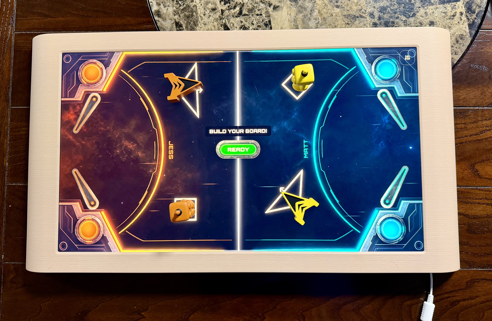

# Board.fun Game Starter

A starter template for building games for [Board.fun](https://board.fun)
hardware, a tabletop console that senses physical game pieces on its
touchscreen with **Claude Code as your engineering team**.

This template was distilled from a real two-player game my husband and I built
(neither of us is a game developer). The game stays ours; everything
reusable is here: the process, the tooling, and the hardware findings
that cost us real evenings to learn.



*The hardware this template targets: the screen senses and reacts to the physical pieces sitting on it.*

## Quick start

```
npm install
npm run dev          # playable demo in a desktop browser — no hardware needed
npm test             # 30+ tests, all platform logic covered
```

Then open a Claude Code session and run **`/setup`** to answer
questions about your game (name, players, platform: Board.fun device /
web-hosted / retrofit to another platform) and configures the repo:
prunes modules you don't need, renames everything, seeds your backlog,
and verifies the result stays green.

## What's inside

| | |
|---|---|
| `src/` | Hardened platform core: contact tracking keyed by contactId, snapshot reconciliation (the device never sends removal events), glyphId-0 filtering, save/pause/roster services with desktop fallbacks |
| `src/demo/` | **Claim the Grid** a deliberately trivial two-player demo that exercises every subsystem: zone-based player identity, simultaneous contact-keyed drags, physical-piece cell locking, save, OS pause. Delete it when your real game starts |
| `src/dev/fake-board.js` | Desktop contact simulator where the mouse becomes a synthetic finger, `window.fakeBoard` places synthetic pieces from the console. The Web SDK has no simulator; this is how the whole game stays previewable in a browser |
| `debug/` | **Glyph logger** a standalone diagnostic app that deploys independently of the game. Build your tooling first: this is how you discover your piece set's glyph IDs and how we established most of the hardware findings |
| `builder/` | **Level builder** drag-and-drop level editing with guardrails that refuse (with a reason) instead of silently ignoring, saving through a validating middleware straight into `src/levels/` |
| `docs/` | The docs-as-memory system: append-only inbox → curated wiki → living spec → ADRs. Ships with real, dated platform findings |
| `.claude/skills/` | `/setup` (the configurator) and `/new-decision` (ADR helper) |

## How we work

This template encodes a product process, not just code:

- **Docs before code.** Day one of the real project was reading the
  platform's developer docs and writing up findings which caught the
  SDK changelog advertising a stable release that didn't exist on npm
  yet ([docs/wiki/raw/board-web-sdk-findings.md](docs/wiki/raw/board-web-sdk-findings.md)).
- **Tooling before product.** The first thing we ever deployed to the
  device was the glyph logger, not a game. It answered questions the
  docs couldn't ([docs/wiki/raw/board-hardware-findings.md](docs/wiki/raw/board-hardware-findings.md)).
- **Open questions get filed, not assumed**
  ([docs/spec/requirements.md](docs/spec/requirements.md)), decisions
  get ADRs with the losing alternatives named
  ([docs/decisions/](docs/decisions/)), and findings are dated with
  how they were verified.
- **Guardrails refuse with reasons.** Everywhere an edit can be
  invalid the refusal explains itself.
- **Humility is a feature.** The findings include the bug we were
  SURE was a platform limitation until the platform's own reference
  template proved it was ours (the session-service story in
  [board-hardware-findings.md](docs/wiki/raw/board-hardware-findings.md)).

## Hard-won platform findings (free with the template)

- The device **never delivers contact-removal events**, pieces just
  vanish from the per-frame snapshot. Everything here reconciles.
- **glyphId 0 is "unrecognized"**, shared by bare finger taps and
  badly-seated pieces and on some builds a bare tap arrives as a
  Glyph-type contact. Filter by glyphId, not contact type.
- **Duplicate pieces share one glyphId**, track by contactId.
- **No per-touch player attribution exists.** Player identity must be
  designed in via zones or turns
  ([docs/spec/player-identity.md](docs/spec/player-identity.md)).
- **`web-pack` silently reuses appIds**, across apps packed from one
  directory; **installs need `--timeout 10m`** on slow Wi-Fi; **no
  console-log access** on device (debug via on-screen HUD +
  screenshots). All in [docs/wiki/raw/](docs/wiki/raw/).

## Requirements

Node 18+. For hardware deploys: a paired Board device
(`board-connect`), your piece set's recognition model at
`public/model.tflite` (from the Developer Portal — licensed, so it's
gitignored), and fresh app-ids in `package.json` (`/setup` walks you
through both).

## Provenance & license

Distilled from a real game built nights-and-weekends with Claude Code;
the game's design, story, and art stay private, everything
transferable is here under the MIT license.
